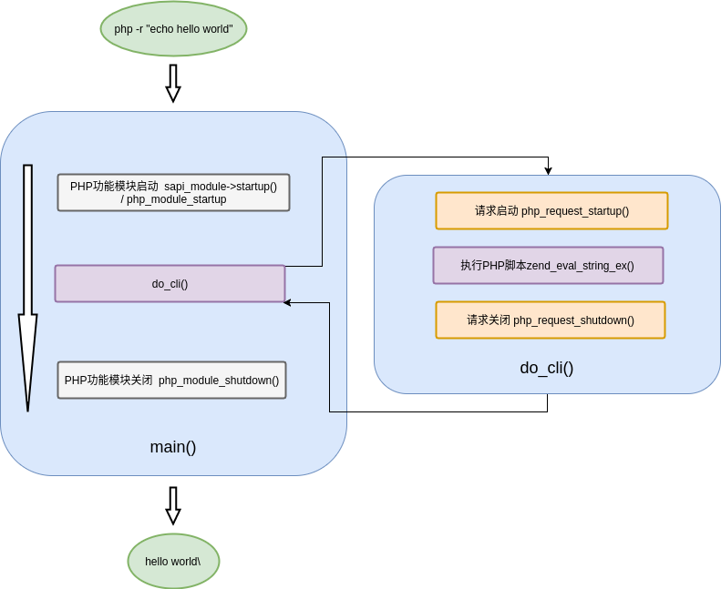
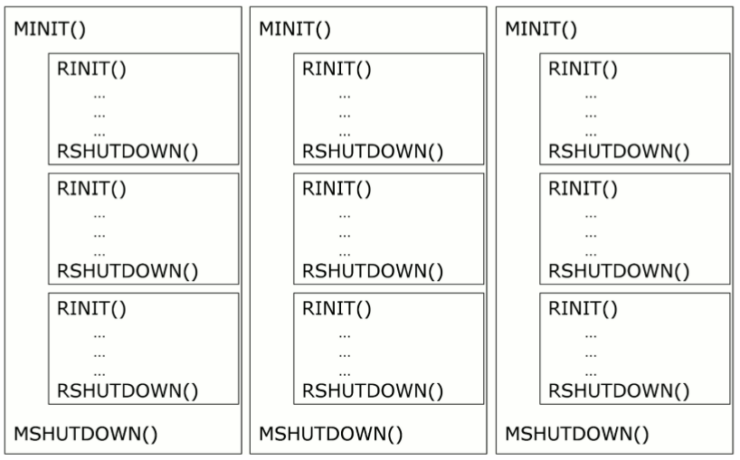
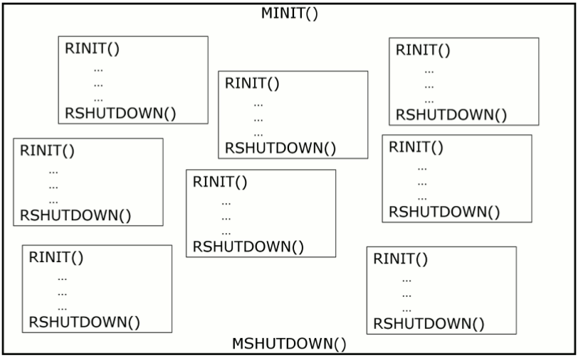
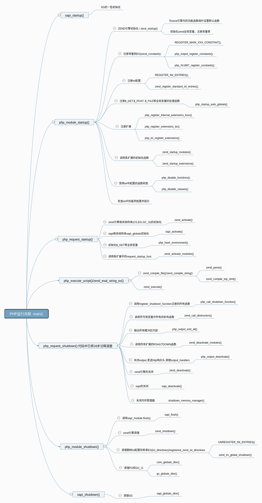

# PHP运行主要步骤


```c
struct _zend_module_entry {
	unsigned short size;
	unsigned int zend_api;
	unsigned char zend_debug;
	unsigned char zts;
	const struct _zend_ini_entry *ini_entry;
	const struct _zend_module_dep *deps;
	const char *name;
	const struct _zend_function_entry *functions;
	int (*module_startup_func)(INIT_FUNC_ARGS);
	int (*module_shutdown_func)(SHUTDOWN_FUNC_ARGS);
	int (*request_startup_func)(INIT_FUNC_ARGS);
	int (*request_shutdown_func)(SHUTDOWN_FUNC_ARGS);
	void (*info_func)(ZEND_MODULE_INFO_FUNC_ARGS);
	const char *version;
	size_t globals_size;
    ...
};
zend_module_entry basic_functions_module = { /* {{{ */
	STANDARD_MODULE_HEADER_EX,
	NULL,
	standard_deps,
	"standard",					/* extension name */
	basic_functions,			/* function list */
	PHP_MINIT(basic),			/* process startup */
	PHP_MSHUTDOWN(basic),		/* process shutdown */
	PHP_RINIT(basic),			/* request startup */
	PHP_RSHUTDOWN(basic),		/* request shutdown */
	PHP_MINFO(basic),			/* extension info */
	PHP_STANDARD_VERSION,		/* extension version */
	STANDARD_MODULE_PROPERTIES
};
```


## 在代码中下断点追踪一下这几个步骤
---


### 基于进程的模型,每个PHP解释器都被操作系统隔离到自己的进程中.这种模式在Unix下很常见.

### 基于线程的模型,每个PHP解释器都使用线程库隔离成一个线程.该模型主要用于Windows操作系统,但也可以与大多数Unix一起使用.这需要PHP及其扩展在ZTS模式下构建.



配置编译PHP时加参数--enable-maintainer-zts则编译出的php为Zend线程安全（ZTS），否则不是线程安全（NTS）。

当使用pthread（POSIX threads）扩展时，或者当web服务器为Apache2 mpm-worker或IIS使用PHP作为模块时，请考虑使用ZTS。当使用FastCGI / FPM或Apache2 mpm-prefork时，您不需要ZTS，因为在PHP运行时使用的多进程处理。

NTS是运行PHP的首选方式。NTS还使您更容易编写和调试扩展。`php -v`查看当前PHP的构建方式，它将在第一行输出中显示ZTS或NTS。在较旧的PHP版本中，如果这两个版本都不显示，那将是NTS。


---

**参考:PHP代码执行过程**




## 参考资料:
    http://www.phpinternalsbook.com/php7/extensions_design/php_lifecycle.html
    http://www.php-internals.com/book/?p=chapt02/02-01-php-life-cycle-and-zend-engine
    https://github.com/pangudashu/php7-internal/
    http://tech.respect-pal.jp/php-helloworld/
    https://github.com/luisedware/Archives/issues/1
    https://secure.php.net/manual/zh/install.unix.apache2.php
    http://httpd.apache.org/docs/current/mpm.html
	https://github.com/tvlooy/php-ext-dev-book


