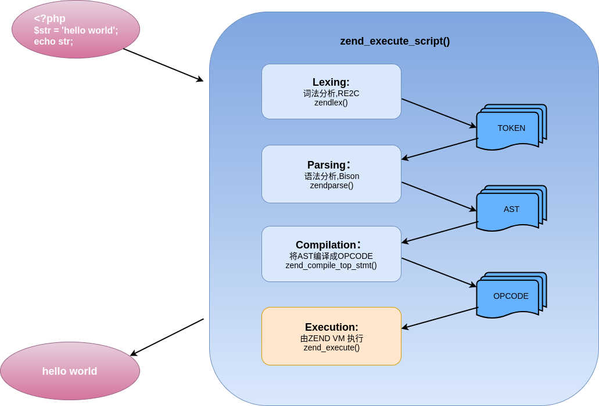

# ZEND引擎编译过程

ZE是一个CISC(复杂指令处理器),正是由于它的存在,所以才能使得我们写PHP脚本时不需要考虑所在的操作系统类型是什么, 它支持170多条指令(定义在 Zend/zend_vm_opcodes.h),包括从最简单的ZEND_ECHO(echo)到复杂的 ZEND_INCLUDE_OR_EVAL(include,require),所有我们编写的PHP都会最终被处理为这些指令(op code)的序列,从而最终被执行.


#### 从最初我们编写的PHP脚本->到最后脚本被执行->得到执行结果,这个过程,可以分为如下几个阶段
    * 首先,Zend Engine(ZE),调用词法分析器,将我们要执行的PHP源文件,去掉空格 ,注释,分割成一个一个的token.
    * 然后,ZE会将得到的token forward给语法分析器,生成抽象语法树.
    * 然后,ZE调用zend_compile_top_stmt()函数将抽象语法树解析为一个一个的op code,opcode一般会以op array的形式存在,它是PHP执行的中间语言.
    * 最后,ZE调用zend_executor来执行op array,输出结果.



#### PHP编译PHP代码时用到的工具
    re2c: 词法分析器,将输入分割为一个个有意义的词块,称为token,Zend/zend_language_scanner.l 文件是re2c的规则文件.
    bison: 语法分析器,确定词法分析器分割出的token是如何彼此关联的,Zend/zend_language_parser.y 文件是bison的规则文件.


# CG变量 zend_global.h/_zend_compiler_globals 


# Token
```php
<?php
$token =  token_get_all('<?php $str="hello world";echo $str;');
foreach ($token as $key => &$value) {
	if(is_array($value)&&(!empty($value[0]))){
		$value[0] = token_name(intval($value[0]));
	}
}
print_r($token);
```

**输出:**
```
Array
(
    [0] => Array
        (
            [0] => T_OPEN_TAG   //TOKEN名称
            [1] => <?php        //匹配到的字符
            [2] => 1            //行号
        )
    [1] => Array
        (
            [0] => T_VARIABLE
            [1] => $str
            [2] => 1
        )
    [2] => =
    [3] => Array
        (
            [0] => T_CONSTANT_ENCAPSED_STRING
            [1] => "hello world"
            [2] => 1
        )
    [4] => ;
    [5] => Array
        (
            [0] => T_ECHO
            [1] => echo
            [2] => 1
        )
    [6] => Array
        (
            [0] => T_WHITESPACE
            [1] =>  
            [2] => 1
        )
    [7] => Array
        (
            [0] => T_VARIABLE
            [1] => $str
            [2] => 1
        )
    [8] => ;
)
```


# AST:
####  PHP7之后的编译过程加了一层抽象语法树,使编译过程更清晰规范,易于优化,语法规则减少,编译速度变快,编译占用内存增加.

#### 查看AST的工具:
    * https://github.com/nikic/PHP-Parser (PHP解析工具)
    * https://pecl.php.net/package/ast  (扩展)
    * https://dooakitestapp.herokuapp.com/phpast/webapp/ (在线)


#### 相关数据结构:Zend/zend_ast.h
```c
enum _zend_ast_kind {
	/* 特殊节点 special nodes */
	ZEND_AST_ZVAL = 1 << ZEND_AST_SPECIAL_SHIFT,
	ZEND_AST_ZNODE,

	/* 声明节点 declaration nodes */
	ZEND_AST_FUNC_DECL,
	ZEND_AST_CLOSURE,
	ZEND_AST_METHOD,
	ZEND_AST_CLASS,

	/* 列表节点 list nodes */
	ZEND_AST_ARG_LIST = 1 << ZEND_AST_IS_LIST_SHIFT,
	ZEND_AST_ARRAY,
    ...
	ZEND_AST_USE,

	/* 普通节点 0 child nodes */
	ZEND_AST_MAGIC_CONST = 0 << ZEND_AST_NUM_CHILDREN_SHIFT,
	ZEND_AST_TYPE,

	/* 1 child node */
	ZEND_AST_VAR = 1 << ZEND_AST_NUM_CHILDREN_SHIFT,
	ZEND_AST_CONST,
    ...
	/* 4 child nodes */
	ZEND_AST_FOR = 4 << ZEND_AST_NUM_CHILDREN_SHIFT,
	ZEND_AST_FOREACH,
};
struct _zend_ast {
	zend_ast_kind kind; /* 节点类型 Type of the node (ZEND_AST_* enum constant) */
	zend_ast_attr attr; /* 附加信息 Additional attribute, use depending on node type */
	uint32_t lineno;    /* 行号 Line number */
	zend_ast *child[1]; /* 子节点 Array of children (using struct hack) */
};
/* Same as zend_ast, but with children count, which is updated dynamically */
typedef struct _zend_ast_list {
	zend_ast_kind kind;
	zend_ast_attr attr;
	uint32_t lineno;
	uint32_t children;
	zend_ast *child[1];
} zend_ast_list;
/* Lineno is stored in val.u2.lineno */
//php脚本中的变量,文字,变量名,调用函数名等,总是终端叶节点
typedef struct _zend_ast_zval {
	zend_ast_kind kind;
	zend_ast_attr attr;
	zval val;
} zend_ast_zval;
/* Separate structure for function and class declaration, as they need extra information. */
/*声明类型的始终有四个子节点
    AST_FUNC_DECL函数定义
        1:AST_PARAM_LIST(参数),2:未使用,
        3:AST_STMT_LIST(函数内部),4:AST_ZVAL(返回值类型)
    AST_CLOSURE匿名函数定义
        1:AST_PARAM_LIST(参数),2:AST_CLOSURE_USES(use),3:AST_STMT_LIST(函数内部),4:AST_ZVAL(返回值类型)
    AST_METHOD方法定义
        1:AST_PARAM_LIST(参数),2:未使用,3:AST_STMT_LIST(函数内部),4:AST_ZVAL(返回值类型)
    AST_CLASS类,匿名类,trait,接口定义
        1:AST_ZVAL(继承源),2:AST_NAME_LIST(implements),3:AST_STMT_LIST(内部定义),4:未使用
*/
typedef struct _zend_ast_decl {
	zend_ast_kind kind;
	zend_ast_attr attr; /* Unused - for structure compatibility */
	uint32_t start_lineno;
	uint32_t end_lineno;
	uint32_t flags;
	unsigned char *lex_pos;
	zend_string *doc_comment;
	zend_string *name;
	zend_ast *child[4];
} zend_ast_decl;
```


# OPCEODE:
opcode是将PHP代码编译产生的Zend虚拟机可识别的指令,php7共有173个opcode,定义在zend_vm_opcodes.h中,这些中间代码会被Zend VM(Zend虚拟机)直接执行.


#### opcode查看:
    * https://3v4l.org/UBstu/vld#output (在线)
    * https://pecl.php.net/package/vld (扩展)

#### VLD输出:
    Finding entry points
    Branch analysis from position: 0
    Jump found. (Code = 62) Position 1 = -2
    filename:       /in/MSj65
    function name:  (null)
    number of ops:  3
    compiled vars:  !0 = $str
    line     #* E I O op                           fetch          ext  return  operands
    -------------------------------------------------------------------------------------
    4     0  E >   ASSIGN                                                   !0, 'hello+world'
    6     1        ECHO                                                     !0
            2      > RETURN                                                   1


#### 相关数据结构Zend/compile.h
    参考:http://blog.csdn.net/phpkernel/article/details/5721384
    http://www.bo56.com/php7%E6%BA%90%E7%A0%81%E5%88%86%E6%9E%90%E4%B9%8Bcg%E5%92%8Ceg/
```c
struct _zend_op_array {
    //common是普通函数或类成员方法对应的opcodes快速访问时使用的字段,后面分析PHP函数实现的时候会详细讲
    ...
    zend_op *opcodes;   //opcode指令数组   
    int last_var;   //PHP代码里定义的变量数:op_type为IS_CV的变量,不含IS_TMP_VAR、IS_VAR的,编译前0,然后发现一个新变量这个值就加1    
    uint32_t T;     //临时变量数:op_type为IS_TMP_VAR、IS_VAR的变量    
    zend_string **vars;     //这个数组在ast编译期间配合last_var用来确定各个变量的编号,非常重要的一步操作//PHP变量名数组
    ...
    HashTable *static_variables;    //静态变量符号表:通过static声明的
    ...   
    int last_literal;   //字面量数量    
    zval *literals;     //字面量(常量)数组,这些都是在PHP代码定义的一些值
    int  cache_size;    //运行时缓存数组大小    
    void **run_time_cache;      //运行时缓存,主要用于缓存一些znode_op以便于快速获取数据,后面单独介绍这个机制

    void *reserved[ZEND_MAX_RESERVED_RESOURCES];
};
struct _zend_op {
    const void *handler; //对应执行的C语言function,即每条opcode都有一个C function处理
    znode_op op1;   //操作数1
    znode_op op2;   //操作数2
    znode_op result; //返回值
    uint32_t extended_value; //用来区别被重载的操作符
    uint32_t lineno; 
    zend_uchar opcode;  //opcode指令
    zend_uchar op1_type; //操作数1类型,为IS_CONST, IS_TMP_VAR, IS_VAR, IS_UNUSED, or IS_CV
    zend_uchar op2_type; //操作数2类型
    zend_uchar result_type; //返回值类型
};
//操作数结构
typedef union _znode_op {
    uint32_t      constant;
    uint32_t      var;
    uint32_t      num;
    uint32_t      opline_num; /*  Needs to be signed */
    uint32_t      jmp_offset;
} znode_op;
```
#### 操作数类型:
```c
//  Zend/zend_compile.h
#define IS_CONST    (1<<0)  //1
#define IS_TMP_VAR  (1<<1)  //2
#define IS_VAR      (1<<2)  //4
#define IS_UNUSED   (1<<3)  //8
#define IS_CV       (1<<4)  //16
```
* IS_CONST:字面量,编译时就可确定且不会改变的值,比如:$a = "hello~",其中字符串"hello~"就是常量
* IS_TMP_VAR:临时变量,比如:$a = "hello~" . time(),其中"hello~" . time()的值类型就是IS_TMP_VAR,再比如:$a = "123" + $b,"123" + $b的结果类型也是IS_TMP_VAR,从这两个例子可以猜测,临时变量多是执行期间其它类型组合现生成的一个中间值,由于它是现生成的,所以把IS_TMP_VAR赋值给IS_CV变量时不会增加其引用计数
* IS_VAR:PHP变量,这个很容易认为是PHP脚本里的变量,其实不是,这里PHP变量的含义可以这样理解:PHP变量是没有显式的在PHP脚本中定义的,不是直接在代码通过$var_name定义的.这个类型最常见的例子是PHP函数的返回值,再如$a[0]数组这种,它取出的值也是IS_VAR,再比如$$a这种
* IS_UNUSED:表示操作数没有用
* IS_CV:PHP脚本变量,即脚本里通过$var_name定义的变量,这些变量是编译阶段确定的,所以是compile variable,


#### opcode handler 的索引算法
//zend_vm_execute.h -> /zend_vm_get_opcode_handler()


#### 编译后的CG(active_op_array)结构图


### 参考资料:
    PHP代码的编译:https://github.com/pangudashu/php7-internal
    PHP官网关于AST的RFC:
        https://wiki.php.net/rfc/ast_based_parsing_compilation_process
        https://wiki.php.net/rfc/abstract_syntax_tree
    AST彻底解说:https://www.slideshare.net/do_aki/php-ast
    VLD扩展使用指南:http://www.php-internals.com/book/?p=C-php-vld


