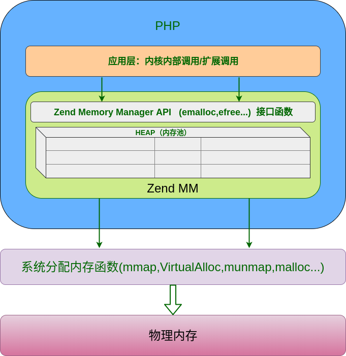
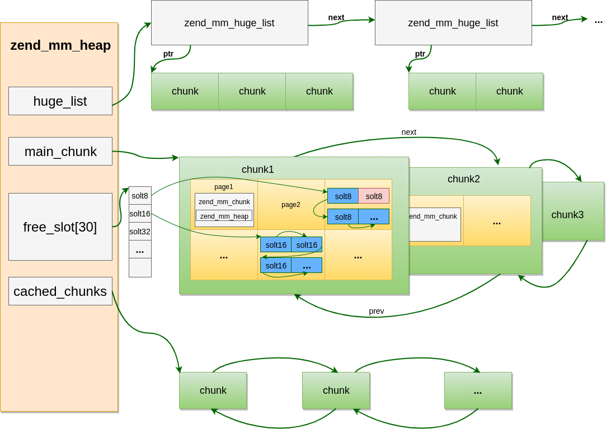

## 内存管理概述

>目前除了使用C/C++等这类的低层编程语言以外，很多编程语言都将内存管理移到了语言之后， 例如Java, 各种脚本语言:PHP/Python/Ruby等等，程序手动维护内存的成本非常大， 而这些脚本语言或新型语言都专注于特定领域，这样能将程序员从内存管理中解放出来专注于业务的实现。 虽然程序员不需要手动维护内存，而在程序运行过程中内存的使用还是要进行管理的， 内存管理的工作也就编程语言实现程序员的工作了。

>内存管理的主要工作是尽可能高效的利用内存。在PHP层面来看，定义的变量、类、函数等实体在运行过程中都会涉及到内存的申请和释放， 例如变量可能会在超出作用域后会进行销毁，在计算过程中会产生的临时数据等都会有内存操作， 像类对象，函数定义等数据则会在请求结束之后才会被释放。在这过程中何时申请内存及释放内存就比较关键了。 PHP从开始就有一套属于自己的内存管理机制，在5.3之前使用的是经典的引用计数技术， 但引用计数存在一定的技术缺陷，在PHP5.3之后，引入了新的垃圾回收机制，至此，PHP的内存管理机制更加完善。

>每个平台操作内存的方式包括申请内存，销毁内存，修改内存的大小等。如果应用程序向系统申请内存，系统便会在内存中寻找还没有被使用的地方，如果有合适的，便分配给这个程序，并标记下来，不再给其它的程序了。如果一个内存块没有释放，而所有者应用程序也永远不再使用它了。那么，我们就称其为"内存泄漏"，那么这部分内存就无法再为其它程序所用了。 在一个典型的客户端应用程序中，偶尔的小量的内存泄漏是可以被操作系统容忍的，因为在进程结束后该泄漏内存会被返回给OS。这并没有什么高科技含量，因为OS知道它把该内存分配给了哪个程序，并且它能够在一个程序结束后把这些内存给回收回来。 但是，世界总是不缺乏特例！对于一些需要长时间运行的程序，比如像Apache这样的web服务器以及它的php模块来说，都是伴随着操作系统长时间运行的，所以OS在很长一段时间内不能主动的回收内存，从而导致这个程序的每一个内存泄漏都会促进量变到质变的进化，最终引起严重的内存泄漏错误，使系统的资源消耗殆尽。所以对于类似于PHP这样没有低层内存管理的语言来说， 内存管理是其至关重要的一个模块，它在很大程度上决定了程序的执行效率。

>由于计算机的内存由操作系统进行管理，所以普通应用程序是无法直接对内存进行访问的， 应用程序只能向操作系统申请内存，通常的应用也是这么做的，在需要的时候通过类似malloc之类的库函数 向操作系统申请内存，在一些对性能要求较高的应用场景下是需要频繁的使用和释放内存的， 比如Web服务器，编程语言等，由于向操作系统申请内存空间会引发系统调用， 系统调用和普通的应用层函数调用性能差别非常大，因为系统调用会将CPU从用户态切换到内核， 因为涉及到物理内存的操作，只有操作系统才能进行，而这种切换的成本是非常大的， 如果频繁的在内核态和用户态之间切换会产生性能问题。

>鉴于系统调用的开销，一些对性能有要求的应用通常会自己在用户态进行内存管理， 例如第一次申请稍大的内存留着备用，而使用完释放的内存并不是马上归还给操作系统， 可以将内存进行复用，这样可以避免多次的内存申请和释放所带来的性能消耗。


## PHP的内存管理实现


### Zend内存管理器

Zend内存管理器(Zend Memory Manager)，通常缩写为ZendMM或ZMM，是一个现代的CPU缓存友好的内存管理器,大多数想法都来自jemalloc和tcmalloc实现。旨在提供分配和释放动态请求限制内存的能力。PHP不需要显式的对内存进行管理，这些工作都由Zend引擎进行管理了。PHP处理两个请求之间是没有共享内存数据的。在一个Web请求结束时，将释放在请求期间所有分配的HEAP内存，这个分配和释放的过程是通过ZENDMM实现的。



ZEND MM 作用:

    通过在进程堆上实现自定义堆来防止堆碎片。
    内存消耗管理,监视并限制请求的内存使用情况。（memory_limit,memory_get_usage的实现）
    内存泄漏跟踪及错误提示和自动释放。(使用PHP 的调试版本，并在php.ini中配置report_memleaks = On（默认）)
    通过预先分配的一些常用大小的内存块进行缓存，加快分配速度,减少系统调用和碎片。
    提高了运行性能


ZEND MM API:
Zend/zend_alloc.h/line:158 “p”代表“persitent”

在编写PHP Core或扩展时存在两种动态内存分配：
    基于请求的动态分配。
    持久动态分配。

持久和非持久分配比如:    
```c
zend_string *foo = zend_string_init("foo", strlen("foo"), 0);
zend_string *foo = zend_string_init("foo", strlen("foo"), 1);
```


### 内存池实现
内存池是内核中最底层的内存操作，定义了三种粒度的内存块：chunk、page、slot，每个chunk的大小为2M，page大小为4KB，一个chunk被切割为512个page，而一个或若干个page被切割为多个slot，所以申请内存时按照不同的申请大小决定具体的分配策略：

	Huge(chunk): 申请内存大于2M，直接调用系统分配，分配若干个chunk,第一个page用于保存chunk结构，剩下的511个page用于内存分配
	Large(page): 申请内存大于3092B(3/4 page_size)，小于2044KB(511 page_size)，分配若干个page
	Small(slot): 申请内存小于等于3092B(3/4 page_size)，内存池提前定义好了30种同等大小的内存(8,16,24,32，...3072)，他们分配在不同的page上(不同大小的内存可能会分配在多个连续的page)，申请内存时直接在对应page上查找可用位置

    1chunk=2M=512page 
    1page=4KB=?slot
    1slot=8|16|24|32..|3072B

chunk、page、slot三种内存粒度中chunk的分配是直接向系统申请的，这里调用的是操作系统提供的的mmap函数.




#### 数据结构
```code
struct _zend_mm_heap {
#if ZEND_MM_STAT
	size_t             size;                    /* 当前已用内存数 current memory usage */
	size_t             peak;                    /* 内存单次申请的峰值 peak memory usage */
#endif
	zend_mm_free_slot *free_slot[ZEND_MM_BINS]; /* 小内存分配的可用位置链表，ZEND_MM_BINS等于30，即此数组表示的是各种大小内存对应的链表头部 free lists for small sizes */
#if ZEND_MM_STAT || ZEND_MM_LIMIT
	size_t             real_size;               /* 当前已分配页的真实大小 current size of allocated pages */
#endif
#if ZEND_MM_STAT
	size_t             real_peak;               /* 当前已分配页真实大小的峰值 peak size of allocated pages */
#endif
#if ZEND_MM_LIMIT
	size_t             limit;                   /* memory limit */
	int                overflow;                /* memory overflow flag */
#endif

	zend_mm_huge_list *huge_list;               /* 大内存链表 list of huge allocated blocks */
	zend_mm_chunk     *main_chunk;				/* 指向chunk链表头部 */
	zend_mm_chunk     *cached_chunks;			/* 缓存的chunk链表 list of unused chunks */
	int                chunks_count;			/* 已分配chunk数 number of alocated chunks */
	int                peak_chunks_count;		/* 当前request使用chunk峰值 peak number of allocated chunks for current request */
	int                cached_chunks_count;		/* 缓存的chunk数 number of cached chunks */
	double             avg_chunks_count;		/* chunk使用均值，每次请求结束后会根据peak_chunks_count重新计算:(avg_chunks_count+peak_chunks_count)/2.0    average number of chunks allocated per request */
};
struct _zend_mm_chunk {
	zend_mm_heap      *heap;					/* 指向heap */
	zend_mm_chunk     *next;					/* 指向下一个chunk */
	zend_mm_chunk     *prev;					/* 指向上一个chunk */
	uint32_t           free_pages;				/* 此块中的当前空闲页数 number of free pages */
	uint32_t           free_tail;               /* 数据块结尾的连续空闲页的起始编号 number of free pages at the end of chunk */
	uint32_t           num;						/* chunk编号 */
	char               reserve[64 - (sizeof(void*) * 3 + sizeof(int) * 3)];	/* 保留成员，和前几个成员一起共占64个字节 */
	zend_mm_heap       heap_slot;               /* heap结构，只有主chunk会用到 used only in main chunk */
	zend_mm_page_map   free_map;                /* 空闲页位图 512 bits or 64 bytes */
	zend_mm_page_info  map[ZEND_MM_PAGES];      /* 各page的信息：当前page使用类型(用于large分配还是small)、占用的page数等  2 KB = 512 * 4 */
};
```

#### 内存池的初始化
内存池在php_module_startup阶段初始化，
php_module_startup()->zend_startup()->start_memory_manager()->alloc_globals_ctor(&alloc_globals)->zend_mm_init()：

Zend/zend_alloc.c
```code
# define AG(v) (alloc_globals.v)
static zend_alloc_globals alloc_globals;

static zend_mm_heap *zend_mm_init(void){
    //向系统申请2M大小的chunk
	zend_mm_chunk *chunk = (zend_mm_chunk*)zend_mm_chunk_alloc_int(ZEND_MM_CHUNK_SIZE, ZEND_MM_CHUNK_SIZE);
	zend_mm_heap *heap;

	if (UNEXPECTED(chunk == NULL)) {
		return NULL;
	}
	heap = &chunk->heap_slot;//heap结构实际是主chunk嵌入的一个结构，后面再分配chunk的heap_slot不再使用
	chunk->heap = heap;
	chunk->next = chunk;
	chunk->prev = chunk;
	chunk->free_pages = ZEND_MM_PAGES - ZEND_MM_FIRST_PAGE;//剩余可用page数
	chunk->free_tail = ZEND_MM_FIRST_PAGE;
	chunk->num = 0;
	chunk->free_map[0] = (Z_L(1) << ZEND_MM_FIRST_PAGE) - 1;//将第一个page的bit分配标识位设置为1
	chunk->map[0] = ZEND_MM_LRUN(ZEND_MM_FIRST_PAGE);//第一个page的类型为ZEND_MM_IS_LRUN，即large内存
	heap->main_chunk = chunk;//指向主chunk
	heap->cached_chunks = NULL;//缓存chunk链表
	heap->chunks_count = 1;//已分配chunk数
	heap->peak_chunks_count = 1;
	heap->cached_chunks_count = 0;
	heap->avg_chunks_count = 1.0;
	heap->huge_list = NULL;//huge内存链表
	return heap;
}
```

#### 内存分配
emalloc->zend_mm_alloc_heap->根据要分配的目标大小 ，调用不同的函数。
```code
#define ZEND_MM_MAX_SMALL_SIZE      3072
#define ZEND_MM_MAX_LARGE_SIZE      (ZEND_MM_CHUNK_SIZE - (ZEND_MM_PAGE_SIZE * ZEND_MM_FIRST_PAGE))

static zend_always_inline void *zend_mm_alloc_heap(zend_mm_heap *heap, size_t size)
{
	void *ptr;
	if (size <= 3072) {
		ptr = zend_mm_alloc_small(heap, size, ZEND_MM_SMALL_SIZE_TO_BIN(size));
		return ptr;
	} else if (size <= (2*1024*1024-4*1024*1)) {
		ptr = zend_mm_alloc_large(heap, size);
		return ptr;
	} else {
		return zend_mm_alloc_huge(heap, size);
	}
}
```

##### Huge分配
huge的分配实际就是分配多个chunk，chunk的分配也是large、small内存分配的基础，它是ZendMM向系统申请内存的唯一粒度。
超过2M内存的申请，与通用的内存申请没有太大差别，只是将申请的内存块通过单链表进行了管理。
chunk分配时是按照ZEND_MM_CHUNK_SIZE对齐的，也就是chunk的起始内存地址一定是ZEND_MM_CHUNK_SIZE的整数倍，所以可以根据chunk上的任意位置知道chunk的起始位置。
```code
static void *zend_mm_alloc_huge(zend_mm_heap *heap, size_t size){
	size_t new_size = ZEND_MM_ALIGNED_SIZE_EX(size, REAL_PAGE_SIZE);   //按页大小重置实际要分配的内存
	void *ptr;
	ptr = zend_mm_chunk_alloc(heap, new_size, ZEND_MM_CHUNK_SIZE);     //分配chunk
	if (UNEXPECTED(ptr == NULL)) {
		/* insufficient memory 清理后再尝试分配一次 */
		if (zend_mm_gc(heap) && (ptr = zend_mm_chunk_alloc(heap, new_size, ZEND_MM_CHUNK_SIZE)) != NULL) {
            //申请成功
		} else {
            //申请失败
			zend_mm_safe_error(heap, "Out of memory (allocated %zu) (tried to allocate %zu bytes)", heap->real_size, size);
			return NULL;
		}
	}
	//将申请的内存通过zend_mm_huge_list插入到链表中,heap->huge_list指向的实际是zend_mm_huge_list
	zend_mm_add_huge_block(heap, ptr, new_size);
	return ptr;
}
```

##### Large分配
大于3/4的page_size(4KB)且小于等于511个page_size的内存申请，也就是一个chunk的大小够用(之所以是511个page而不是512个是因为第一个page始终被chunk结构占用)，如果申请多个page的话 分配的时候这些page都是连续的 

查找过程就是从第一个chunk开始搜索，如果当前chunk没有合适的则进入下一chunk，如果直到最后都没有找到则新创建一个chunk。
注意：查找page的过程并不仅仅是够数即可，这里有一个标准是：申请的一个或多个的page要尽可能的填满chunk的空隙 ，也就是说如果当前chunk有多块内存满足需求则会选择最合适的那块，而合适的标准前面提到的那个。

page分配完成后会将free_map对应整数的bit位从page_num至(page_num+page_count)置为1，同时将chunk->map[page_num]置为ZEND_MM_LRUN(pages_count)，表示page_num至(page_num+page_count)这些page是被Large分配占用的。

ZEND_MM_FRUN()
ZEND_MM_LRUN(count)
ZEND_MM_SRUN(bin_num)
ZEND_MM_SRUN_EX(bin_num, count)
ZEND_MM_NRUN(bin_num, offset)

##### Small分配
small内存指的是小于(3/4 page_size)的内存，这些内存首先也是申请了1个或多个page，然后再将这些page按固定大小切割了。

small内存总共有30种固定大小的规格：8,16,24,32,40,48,56,64,80,96,112,128 ... 1792,2048,2560,3072 Byte，我们把这称之为slot，这些slot定义在zend_alloc_sizes.h中：


#### 内存释放

```code
static zend_always_inline void zend_mm_free_heap(zend_mm_heap *heap, void *ptr ZEND_FILE_LINE_DC ZEND_FILE_LINE_ORIG_DC)
{
	//根据内存地址及对齐值判断内存地址偏移量是否为0，是的话只有huge情况符合，page、slot分配出的内存地>址偏移量一定是>=ZEND_MM_CHUNK_SIZE的，因为第一页始终被chunk自身结构占用，不可能分配出去
	//offset就是ptr距离当前chunk起始位置的偏移量
	size_t page_offset = ZEND_MM_ALIGNED_OFFSET(ptr, ZEND_MM_CHUNK_SIZE);
	if (UNEXPECTED(page_offset == 0)) {
		if (ptr != NULL) {
			//释放huge内存，从huge_list中删除
			zend_mm_free_huge(heap, ptr ZEND_FILE_LINE_RELAY_CC ZEND_FILE_LINE_ORIG_RELAY_CC);
		}
	} else {//page或slot，根据chunk->map[]值判断当前page的分配类型
		//根据ptr获取chunk的起始位置
		zend_mm_chunk *chunk = (zend_mm_chunk*)ZEND_MM_ALIGNED_BASE(ptr, ZEND_MM_CHUNK_SIZE);
		int page_num = (int)(page_offset / ZEND_MM_PAGE_SIZE);
		zend_mm_page_info info = chunk->map[page_num];
		ZEND_MM_CHECK(chunk->heap == heap, "zend_mm_heap corrupted");
		if (EXPECTED(info & ZEND_MM_IS_SRUN)) {
			zend_mm_free_small(heap, ptr, ZEND_MM_SRUN_BIN_NUM(info));//slot的释放上一节已经介绍过，就是个普通的链表插入操作
		} else /* if (info & ZEND_MM_IS_LRUN) */ {
			int pages_count = ZEND_MM_LRUN_PAGES(info);

			ZEND_MM_CHECK(ZEND_MM_ALIGNED_OFFSET(page_offset, ZEND_MM_PAGE_SIZE) == 0, "zend_mm_heap corrupted");
			zend_mm_free_large(heap, chunk, page_num, pages_count);//释放page，将free_map中的标识位设置为未分配
		}
	}
}
```


#### 内存池的销毁

```code
void zend_mm_shutdown(zend_mm_heap *heap, int full, int silent){
	zend_mm_chunk *p;
	zend_mm_huge_list *list;

	/* 释放所有huge内存块 free huge blocks */
	list = heap->huge_list;
	heap->huge_list = NULL;
	while (list) {
		zend_mm_huge_list *q = list;
		list = list->next;
		zend_mm_chunk_free(heap, q->ptr, q->size);
	}

	/*将除了第一个外的所有chunk移动到chunk缓存中 move all chunks except of the first one into the cache */
	p = heap->main_chunk->next;
	while (p != heap->main_chunk) {
		zend_mm_chunk *q = p->next;
		p->next = heap->cached_chunks;
		heap->cached_chunks = p;
		p = q;
		heap->chunks_count--;
		heap->cached_chunks_count++;
	}

	if (full) {//如果是进程运行结束，则释放所有chunk，包括chunk缓存和main_chunk
		/* free all cached chunks */
		while (heap->cached_chunks) {
			p = heap->cached_chunks;
			heap->cached_chunks = p->next;
			zend_mm_chunk_free(heap, p, ZEND_MM_CHUNK_SIZE);
		}
		/* free the first chunk */
		zend_mm_chunk_free(heap, heap->main_chunk, ZEND_MM_CHUNK_SIZE);
	} else {//进程继续运行，请求结束进行的释放操作
		zend_mm_heap old_heap;

		/* 释放一些缓存的chunk，保持平均水平  free some cached chunks to keep average count */
		heap->avg_chunks_count = (heap->avg_chunks_count + (double)heap->peak_chunks_count) / 2.0;
		while ((double)heap->cached_chunks_count + 0.9 > heap->avg_chunks_count &&
		       heap->cached_chunks) {
			p = heap->cached_chunks;
			heap->cached_chunks = p->next;
			zend_mm_chunk_free(heap, p, ZEND_MM_CHUNK_SIZE);
			heap->cached_chunks_count--;
		}
		/* 清空缓存chunk中的内容  clear cached chunks */
		p = heap->cached_chunks;
		while (p != NULL) {
			zend_mm_chunk *q = p->next;
			memset(p, 0, sizeof(zend_mm_chunk));
			p->next = q;
			p = q;
		}
		/* 重新初始化heap和第一个chunk reinitialize the first chunk and heap */
		old_heap = *heap;
		p = heap->main_chunk;
		memset(p, 0, ZEND_MM_FIRST_PAGE * ZEND_MM_PAGE_SIZE);
		*heap = old_heap;
		memset(heap->free_slot, 0, sizeof(heap->free_slot));
		heap->main_chunk = p;
		p->heap = &p->heap_slot;
		p->next = p;
		p->prev = p;
		p->free_pages = ZEND_MM_PAGES - ZEND_MM_FIRST_PAGE;
		p->free_tail = ZEND_MM_FIRST_PAGE;
		p->free_map[0] = (1L << ZEND_MM_FIRST_PAGE) - 1;
		p->map[0] = ZEND_MM_LRUN(ZEND_MM_FIRST_PAGE);
		heap->chunks_count = 1;
		heap->peak_chunks_count = 1;
	}
}
```


## 内存调试

	Normal:
		$ sapi/cli/php -r 'leak();'
	Zend MM disabled:
		$ USE_ZEND_ALLOC=0 valgrind --leak-check=full sapi/cli/php -r 'leak();'


## 参考资料:
    https://github.com/pangudashu/php7-internal/blob/master/5/zend_alloc.md
    http://blog.jpauli.tech/2014/07/02/php-memory.html
    https://secure.php.net/manual/en/internals2.memory.php
    http://www.php-internals.com/book/?p=chapt06/06-00-memory-management
    https://fr.slideshare.net/jpauli/understanding-php-memory
	http://www.phpinternalsbook.com/php7/memory_management/zend_memory_manager.html


