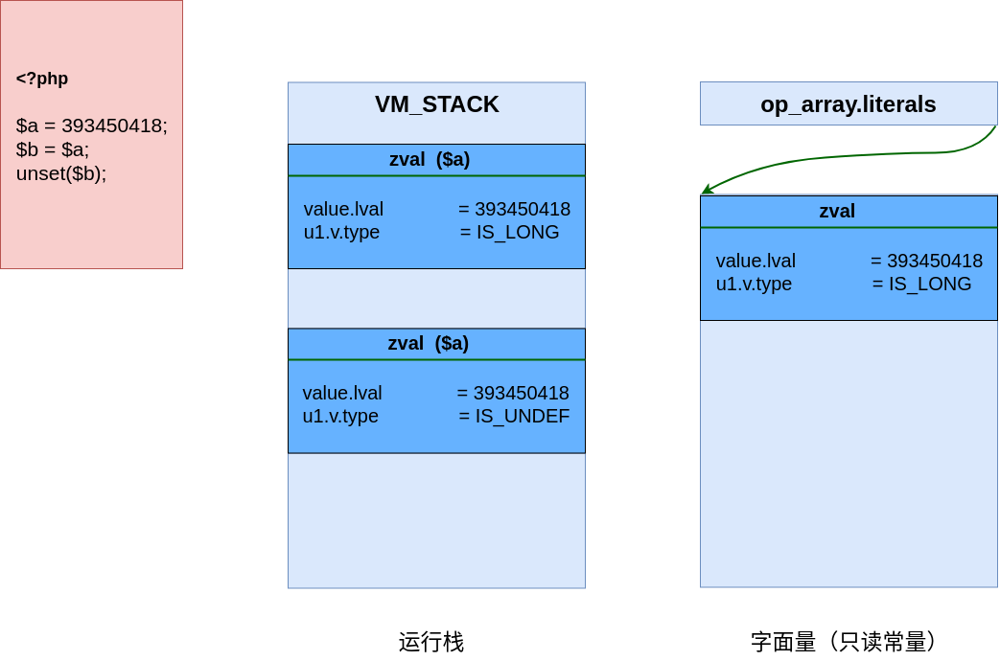
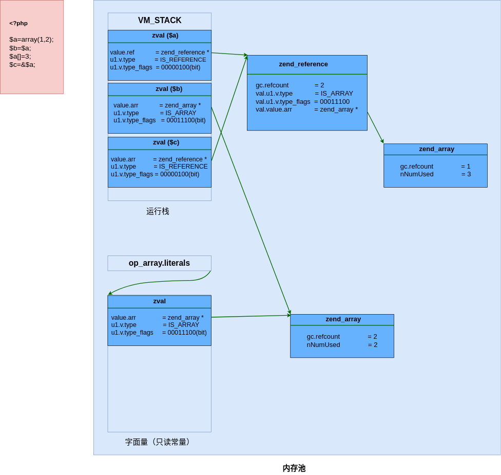
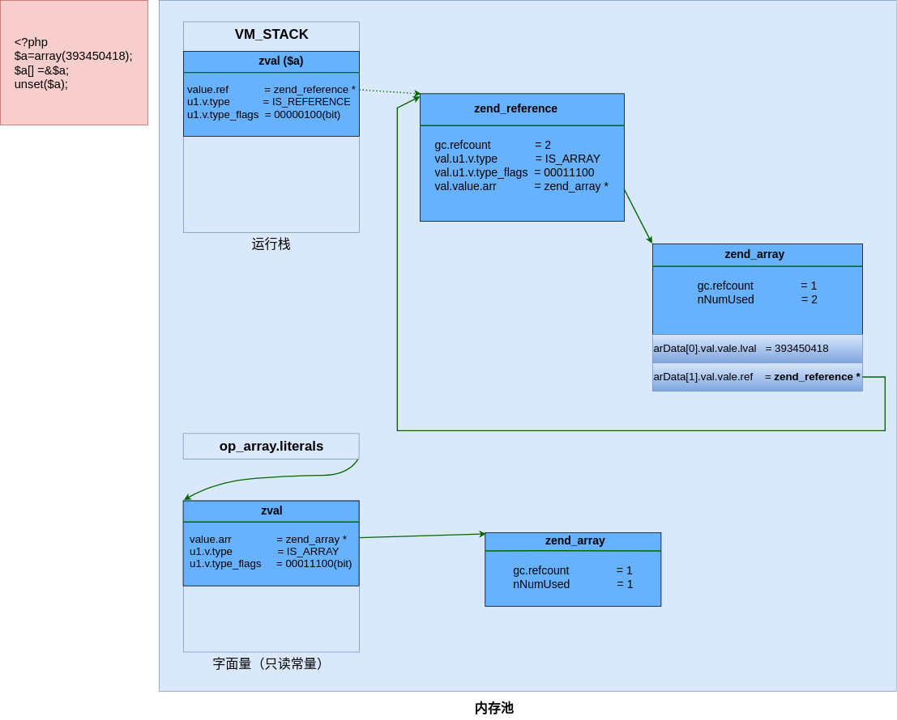

## 引用计数-写时复制

```php
<?php
$a = 393450418;
$b = $a;
unset($b);
```


```php
<?php
$a = array(1,2);
$b = $a;
$a[]=3;
$c = &$a;
```


```php
<?php
$a = array(393450418);
$a[] = &$a;
unset($a);
```


```php
<?php
class Foo{
    public $var = '3.1415962654';
}
for ( $i = 0; $i <= 1000000; $i++ ){
    $a = new Foo;
    $a->self = $a;
}

```


```code
/* zval.u1.v.type_flags */
#define IS_TYPE_CONSTANT                    (1<<0) /* 是常量类型  */
#define IS_TYPE_IMMUTABLE                   (1<<1) /* 不可变的类型， 比如存在共享内存的数组  */
#define IS_TYPE_REFCOUNTED                  (1<<2) /* 需要引用计数的类型  */
#define IS_TYPE_COLLECTABLE                 (1<<3) /* 可能包含循环引用的类型(IS_ARRAY, IS_OBJECT)  */
#define IS_TYPE_COPYABLE                    (1<<4) /* 可被复制的类型， 对象和资源就不可复制  */
/*
                | refcounted | collectable | copyable | immutable
----------------+------------+-------------+----------+----------
simple types    |            |             |          |
string          |      x     |             |     x    |
interned string |            |             |          |
array           |      x     |      x      |     x    |
immutable array |            |             |          |     x
object          |      x     |      x      |          |
resource        |      x     |             |          |
reference       |      x     |             |          |
*/
/* string flags (zval.value->gc.u.flags) */
#define IS_STR_PERSISTENT                   (1<<0) /* 是malloc分配内存的字符串  allocated using malloc  */
#define IS_STR_INTERNED                     (1<<1) /* php代码里写的一些字面量，比如函数名、变量值  interned string  */
#define IS_STR_PERMANENT                    (1<<2) /* 永久值，生命周期大于request  relives request boundary  */
#define IS_STR_CONSTANT                     (1<<3) /* 代表常量的字符串  constant index  */
#define IS_STR_CONSTANT_UNQUALIFIED         (1<<4) /* the same as IS_CONSTANT_UNQUALIFIED  */
```


## 什么算垃圾
首先我们需要定义一下“垃圾”的概念，新的GC负责清理的垃圾是指变量的容器zval还存在，但是又没有任何变量名指向此zval。因此GC判断是否为垃圾的一个重要标准是有没有变量名指向变量容器zval。

假设我们有一段PHP代码，使用了一个临时变量$tmp存储了一个字符串，在处理完字符串之后，就不需要这个$tmp变量了，$tmp变量对于我们来说可以算是一个“垃圾”了，但是对于GC来说，$tmp其实并不是一个垃圾，$tmp变量对我们没有意义，但是这个变量实际还存在，$tmp符号依然指向它所对应的zval，GC会认为PHP代码中可能还会使用到此变量，所以不会将其定义为垃圾。

那么如果我们在PHP代码中使用完$tmp后，调用unset删除这个变量，那么$tmp是不是就成为一个垃圾了呢。很可惜，GC仍然不认为$tmp是一个垃圾，因为$tmp在unset之后，refcount减少1变成了0(这里假设没有别的变量和$tmp指向相同的zval),这个时候GC会直接将$tmp对应的zval的内存空间释放，$tmp和其对应的zval就根本不存在了。此时的$tmp也不是新的GC所要对付的那种“垃圾”。那么新的GC究竟要对付什么样的垃圾呢，下面我们将生产一个这样的垃圾。  

新的GC算法:在较新的PHP手册中有简单的介绍新的GC使用的垃圾清理算法，这个算法名为 Concurrent Cycle Collection in Reference Counted Systems ， 这里不详细介绍此算法，根据手册中的内容来先简单的介绍一下思路：
首先我们有几个基本的准则：
1：如果一个zval的refcount增加，那么此zval还在使用，不属于垃圾
2：如果一个zval的refcount减少到0， 那么zval可以被释放掉，不属于垃圾
3：如果一个zval的refcount减少之后大于0，那么此zval还不能被释放，此zval可能成为一个垃圾

只有在准则3下，GC才会把zval收集起来，然后通过新的算法来判断此zval是否为垃圾。那么如何判断这么一个变量是否为真正的垃圾呢？

简单的说，就是对此zval中的每个元素进行一次refcount减1操作，操作完成之后，如果zval的refcount=0，那么这个zval就是一个垃圾。


## 回收时机


## 回收算法


## 具体实现


## 垃圾回收带来的性能影响


PHP中的垃圾回收机制，主要有两个领域对性能有影响。第一个是内存占用空间的节省，另一个是垃圾回收机制执行内存清理时的执行时间增加(run-time delay)。
仅仅在循环回收算法确实运行时会有时间消耗上的增加。但是在平常的(更小的)脚本中应根本就没有性能影响。长时间运行脚本中有循环回收机制运行的情况下将节省更多内存。


https://secure.php.net/manual/zh/features.gc.performance-considerations.php
http://blog.csdn.net/phpkernel/article/details/5734743


